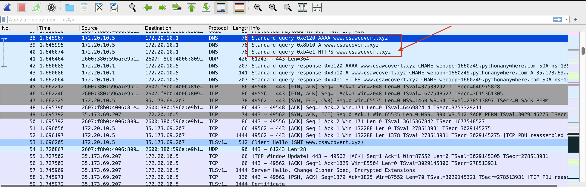

## Covert Write-up
By Minsuh (Endeavy) 

1. Download files (chall.pcapng and keys.log)
2. Open Wireshark and specify key file. (Preferences -> TLS -> (Pre)-Master-Secret log filename)

3. Search for hints in Wireshark. Do you find something?
   I found three hints. First, I found some suspicious URL.

The link https://www.csawcovert.xyz shows how they hide the secret message.

It seems that they use python function ord() and multiply secret key and hide it in the IP ID.
During the investigation I also find some PDF file about embedding covert channels into TCP/IP (https://people.cs.georgetown.edu/~clay/classes/spring2009/555/papers/Embedding_Covert_Channels_into_TCPIP.pdf).

Finally, I found some suspicious packets where there are only TCP Retransmissions between 172.20.10.5 and 172.57.57.57

If we take a look at these packets (No.265~305), we could find out that IP Identifications are some numbers like 5445.
4. Write Python script for decoding it. I just manually write IP IDs.. but I believe there was cleverer way to do it.
```Python
import math
numbers = [5995, 5225, 2640, ...]
# Get greatest common divisor, which can be a secret key
gcd = math.gcd(*numbers)
flag = ""
for n in numbers:
    flag += chr(int(n/gcd))
print(flag)
```
Fortunately, the secret key was the greatest common divisor of numbers, which is 55.
The real source code I used for solving is uploaded to the Github. (covert_solve.py)
Thank you for reading!
