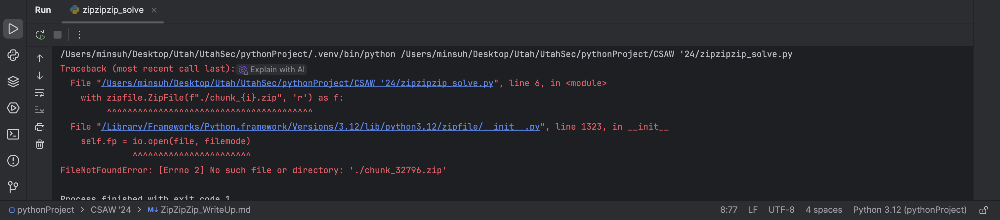
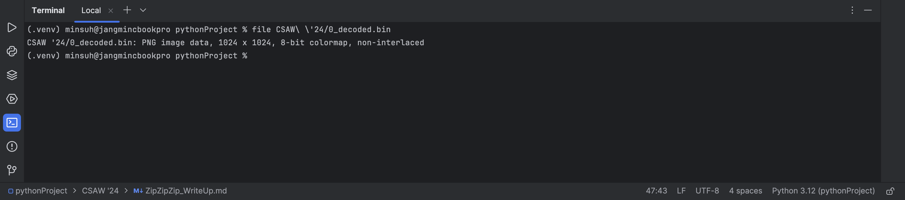

## ZipZipZip Write-up
By Minsuh (Endeavy)

1. Download challenge.zip
2. To know its structure, unzip the challenge.zip.
3. We get directory chunk_0. Inside of the directory, there are chunk_1.zip and chunk_0.txt
4. It seems there will be lots of zip file named chunk_{integer}.
5. So, I wrote python script to simply unzip until it get FileNotFoundError.
```Python
import zipfile

i = 0
while True:
    with zipfile.ZipFile(f"./chunk_{i}.zip", "r") as f:
        f.extractall()
```

It seems that there are only chunk_0.zip to chunk_32795.zip
6. Remove useless zip files.
```Python
import os

for i in range(0, 32796):
    os.remove(f"./chunk_{i}.zip")
```
7. Extract data from all text files (chunk_0.txt to chunk_32795.txt)
```Python
extracted_data = ""
for i in range(0, 32796):
    with open(f"./chunk_{i}.txt", "r") as f:
        data = f.read()
    extracted_data += data
with open("./0_extracted.txt", "w") as f:
    f.write(extracted_data)
```
Look for the extracted file (0_extracted.txt), I think it would be base64 encoded.
8. Decode the file with base64.
```Python
import base64

with open("./0_extracted.txt", "r") as f:
    data = f.read()
decoded = base64.b64decode(data)
with open("0_decoded.bin", "wb") as f:
    f.write(decoded)
```
9. Check for the file type of 0_decode.bin

It seemed that the decoded file is png image file.
If we take a look at the image file, we can find flag right under corner.